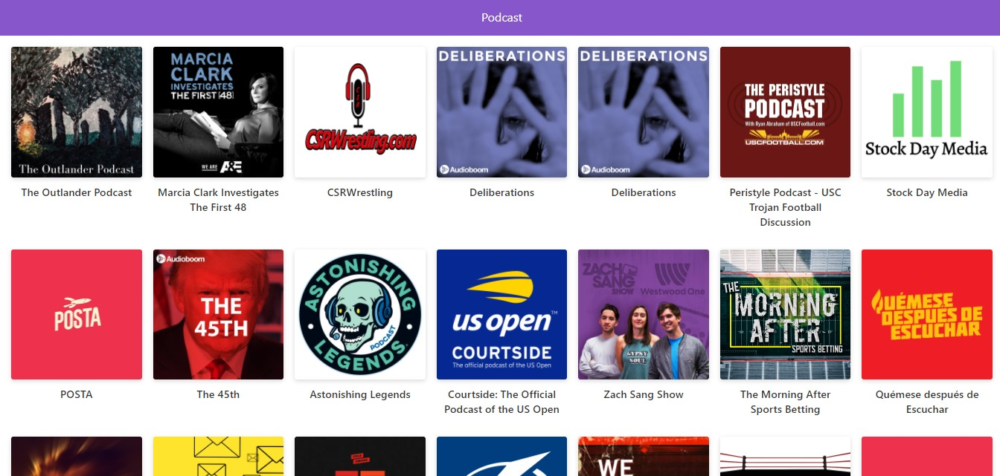

# App de Podcast de Gabo - Curso Platzi

App de podcast integrada a la Api de AudioBoom

https://podcasts.arq-gabo.vercel.app/

## Cómo Funciona???

Require Node.js 12.16.1

`npm install` para instalar las dependencias.

`npm run dev` para el entorno de desarrollo.

`npm run build && npm start` para el entorno de producción

## Licencia

MIT
